# Radeon Cloud 部署 Z-Image-Turbo 生图模型实验指导

适用对象：软件技术、云计算技术相关专业学生
实验平台：Radeon Cloud，https://radeon.anruicloud.com/
实验模型：Tongyi-MAI/Z-Image-Turbo
建议课时：基础实验 30-45 分钟；Notebook 控件版交互生图 1 学时；LoRA 微调 2-4 学时或课后项目

## 一、实验目标

完成本实验后，学生应能完成以下任务：

1. 登录 Radeon Cloud 并启动一个 GPU Notebook/Workspace。
2. 在云端实例中安装依赖并部署 Z-Image-Turbo。
3. 使用 Python 脚本输入提示词并生成图片。
4. 将生图能力封装成一个 Jupyter Notebook 内嵌交互控件。
5. 了解使用少量图片进行 LoRA 微调的基本流程。

本实验：云端 GPU 资源如何支撑一个可运行的 AI 生图应用。

## 二、实验材料

本目录已经准备好以下文件：

```text
/Users/keshiwei/C/RadeonCloud
├── RadeonCloud_ZImage_Turbo_实验指导.md
├── scripts
│   ├── 00_check_gpu.py
│   ├── 01_generate_zimage.py
│   ├── 03_prepare_lora_dataset.py
│   ├── 04_train_lora_reference.sh
│   ├── 06_notebook_photo_widget.py
│   └── install_deps.sh
└── assets
    └── 若干实验截图
```

教师课前建议将 `scripts` 目录上传到一个 GitHub 仓库，例如：

```text
https://github.com/<teacher-name>/radeon-zimage-lab
```

如果不使用 GitHub，也可以在 Jupyter Notebook 中手动上传这些脚本文件。

## 三、平台登录与入口

### 步骤 1：打开 Radeon Cloud

在 Chrome 或 Edge 中打开：

```text
https://radeon.anruicloud.com/
```

### 步骤 2：登录平台

点击右上角登录入口，使用教师提供的账号方式登录。登录成功后，右上角会显示用户名或头像。

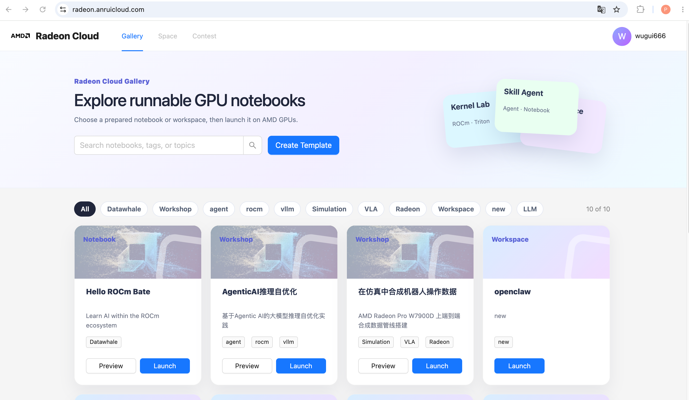

### 步骤 3：认识页面上的关键按钮

Gallery 页面常用按钮如下：

- `Preview`：预览已有 Notebook 模板。
- `Launch`：启动 GPU Notebook/Workspace。
- 顶部 `Gallery`：模板库。
- 顶部 `Space`：查看自己的运行空间或实例。

课堂上学生通常只需要点击某个模板卡片下方的 `Launch`。

## 四、基础实验：通用下载部署方案

本方案使用默认在线下载安装流程。首次运行会下载 Z-Image-Turbo 模型，实测速度较快，通常等待几分钟即可；后续同一实例复用缓存会更快。

### 步骤 1：启动 Blank Notebook

在 Gallery 页面找到 `Blank Notebook` 模板。

如果当前页面第一屏没有看到它，可以：

1. 在搜索框输入 `Blank Notebook`。
2. 或向下滚动 Gallery。
3. 找到卡片后点击 `Launch`。

注意：点击 `Launch` 会申请 GPU 云端资源。课堂中建议由教师统一安排启动时间，避免学生同时反复启动实例。

### 步骤 2：等待 Notebook 就绪

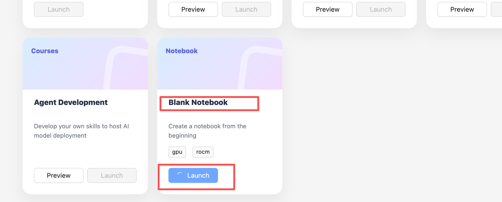

点击 `Launch` 后，平台会显示启动状态。等待状态变为 ready 或出现打开 Notebook 的入口。

如果页面提示只能有一个活动实例，请进入 `Space` 查看已有实例，复用或关闭旧实例。

### 步骤 3：打开 Notebook 终端


进入 Notebook 后，打开 Terminal。通常路径是：

```text
Notebook 页面 -> Launcher -> Terminal
```

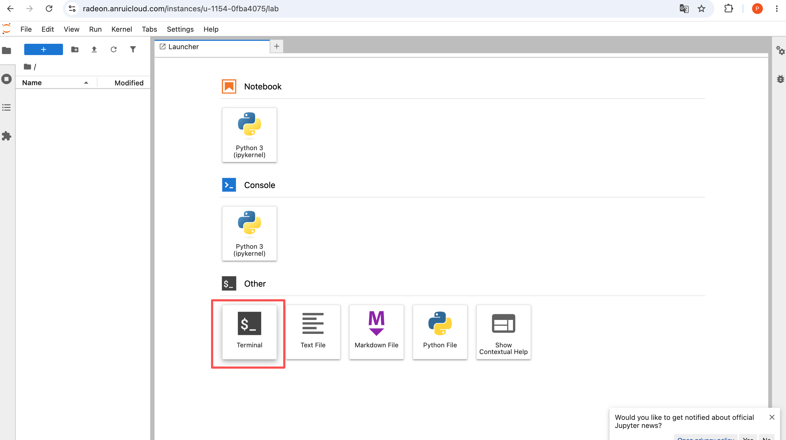

或者在左侧文件区中新建 Notebook，再通过单元格运行命令。

### 步骤 4：获取实验脚本

如果教师已经准备 GitHub 仓库，在终端执行：

```bash
apt-get update
apt-get install -y ca-certificates git
update-ca-certificates
git config --global http.sslCAInfo /etc/ssl/certs/ca-certificates.crt

git -c http.sslVerify=false clone https://github.com/wugui111/radeon-zimage-lab.git
cd radeon-zimage-lab
```

如果教师使用其他仓库，请把上面的仓库地址替换成实际地址。这里的 `http.sslVerify=false` 只作用于本次 `clone` 命令，用来绕过当前 Radeon Cloud 容器访问 GitHub 时的证书链问题；不要设置全局 `git config --global http.sslVerify false`。

### 步骤 5：检查 GPU

在云端终端运行：

```bash
python scripts/00_check_gpu.py
```

预期输出中应包含：

```text
CUDA/ROCm interface available: True
GPU name: ...
GPU memory: ...
```

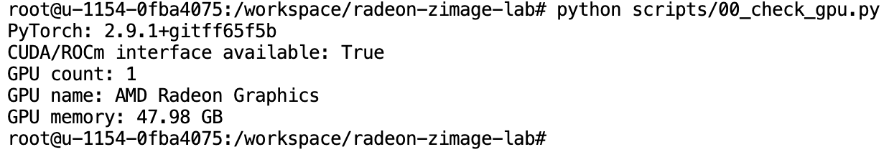

说明：在 ROCm/PyTorch 环境中，AMD GPU 通常仍通过 `cuda` 这个接口名暴露给 Python，看到 `cuda` 是正常现象。

### 步骤 6：安装依赖

本实验直接使用 Radeon Cloud 模板自带的 Python 环境，因为该环境已经能识别 AMD GPU 和 ROCm PyTorch。运行：

```bash
bash scripts/install_deps.sh
```

该脚本会自动完成以下事情：

1. 在容器内安装 `ca-certificates` 和 `git`，修复 GitHub 基础证书缺失问题。
2. 先检查当前基础环境能否通过 `torch.cuda` 看到 AMD GPU。
3. 记录当前 ROCm PyTorch 版本，并用约束文件防止 pip 安装普通 PyPI 版 `torch`。
4. 安装本实验需要的基础生图依赖，并将 `transformers` 固定为 `<5`。
5. 从 PyPI 安装 `diffusers==0.36.0`。这个版本已经包含 `ZImagePipeline`，课堂中不再依赖 GitHub 源码安装。

   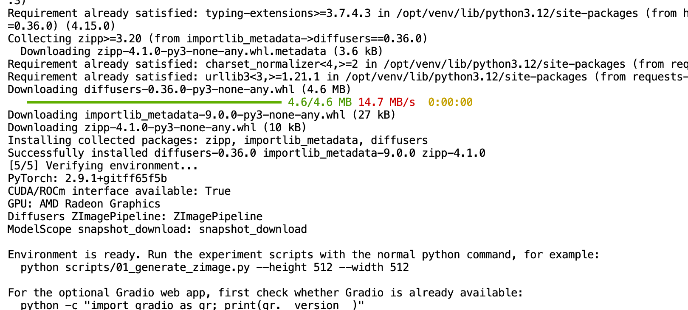

然后再次检查 GPU：

```bash
python scripts/00_check_gpu.py
```

脚本会安装：

- `modelscope`
- `diffusers==0.36.0`
- `transformers>=4.56,<5`
- `accelerate`
- `safetensors`
- `pillow`

如果安装过程中网络较慢，请耐心等待。实际测试中 ModelScope 下载速度较快，课堂可直接使用默认在线下载方案。

### 步骤 7：运行命令行生图脚本

运行：

```bash
python scripts/01_generate_zimage.py
```

默认提示词为：

```text
真实摄影风格，一位年轻旅行者站在清晨的高山湖泊旁，远处雪山和薄雾，金色日出光线，自然表情，电影感构图，高细节，画面中不包含文字和水印
```

这个脚本会下载 Z-Image-Turbo 生图模型，需要等待约5分钟，后续下载好后流程会快很多

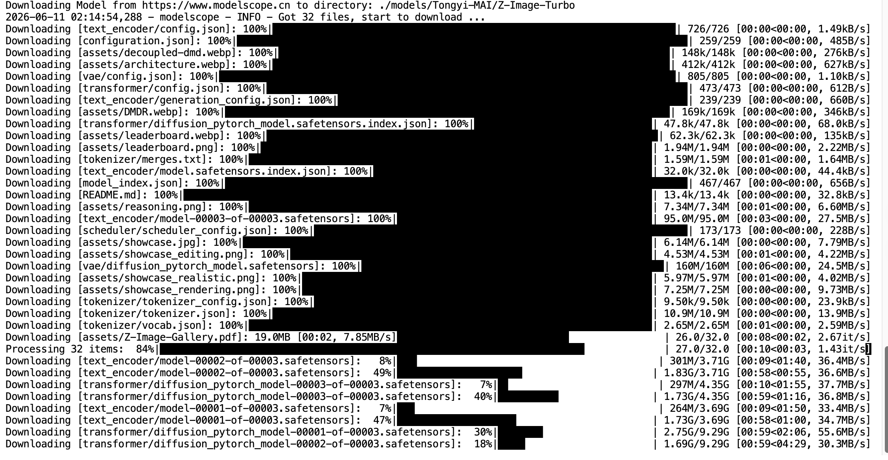

生成完成后，图片会保存到：

```text
outputs/zimage_result.png
```

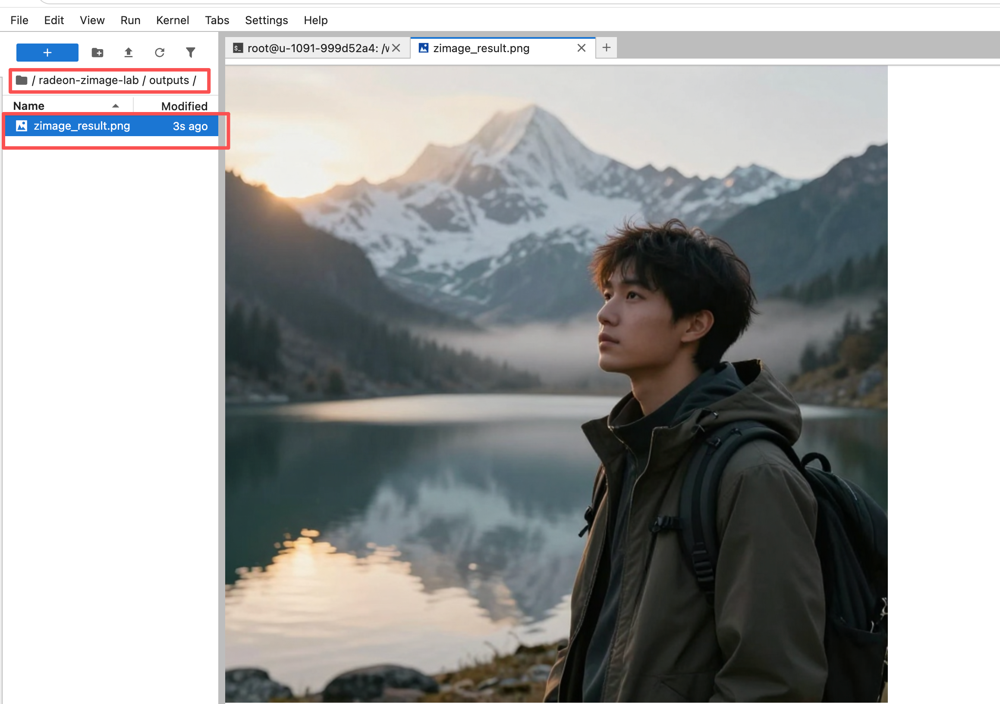

也可以自定义提示词：

```bash
python scripts/01_generate_zimage.py \
  --prompt "真实摄影风格，一位年轻人在雨后的城市街道散步，霓虹灯倒映在路面，电影感色彩，浅景深，画面中不包含文字和水印" \
  --height 768 \
  --width 768 \
  --seed 123 \
  --output outputs/city_portrait.png
```

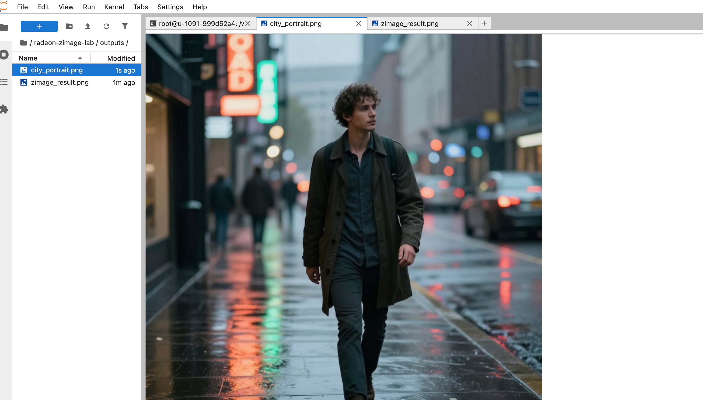

### 步骤 8：查看生成结果

在 Jupyter 文件区打开 `outputs` 目录，双击生成的 `.png` 图片查看。

学生提交截图时至少包含：

1. GPU 检测输出。
2. 生图脚本运行输出。
3. 生成图片。

## 五、进阶实验：Notebook 控件版交互生图

基础脚本跑通后，推荐使用 Jupyter Notebook 内嵌控件版作为交互界面。这个方案直接在 Notebook 输出区运行，不需要额外打开外部网页，课堂使用更稳定。

### 步骤 1：新建 Notebook

在 JupyterLab 左上角点击 `+`，选择 `Python 3 (ipykernel)` 新建 Notebook。


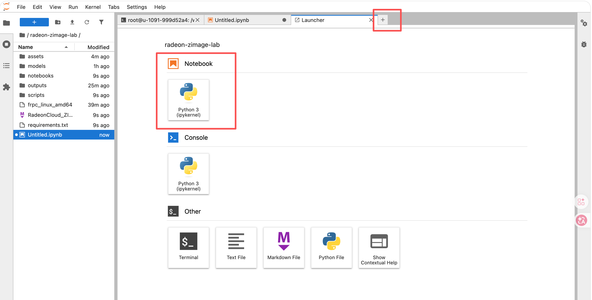

### 步骤 2：启动控件版生图界面

在第一个单元格运行：

```python
%cd /workspace/radeon-zimage-lab
%run scripts/06_notebook_photo_widget.py
```


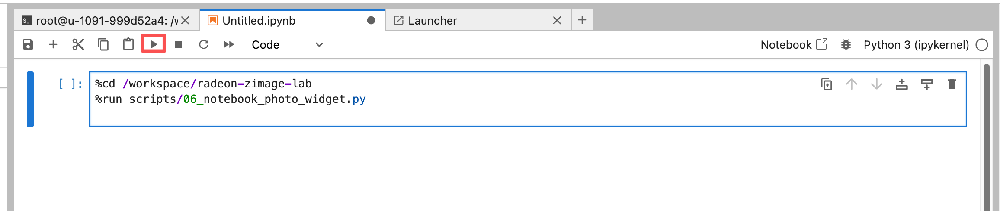

首次运行会加载 Z-Image-Turbo 模型，请等待终端和 Notebook 输出区显示：

```text
Model is ready.
```

随后 Notebook 输出区会出现一个交互面板，包含：

- `场景预设`：高山湖泊旅行照、城市夜景街拍、海边日落人像、森林徒步照片。
- `照片描述`：输入想生成的人物、风景或旅行场景。
- `摄影风格`：选择人像写真、旅行风景照、城市街拍、户外运动照。
- `图片尺寸`：建议课堂默认使用 `512x512`；如果显存充足、生成稳定，再尝试 `640x640` 或 `768x768`。
- `随机种子`：相同提示词和种子通常生成相近结果。
- `生成图片`：点击后开始推理。

### 步骤 3：生成并查看图片

点击 `生成图片` 后，图片会显示在 Notebook 的 `生成预览` 区域，并保存到：

```text
outputs/notebook_photo_时间_seed_种子.png
```


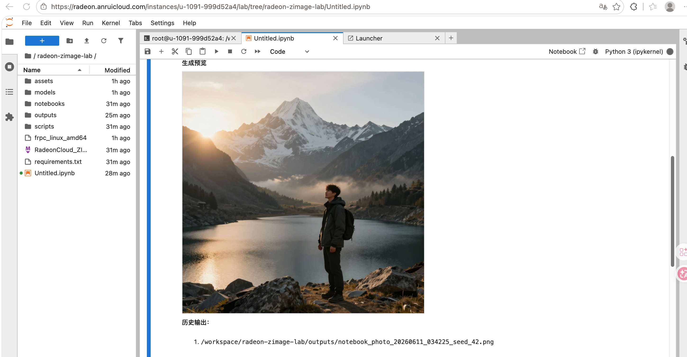

如果 Notebook 输出区没有立即刷新，可以打开左侧 `outputs` 目录查看生成的 `.png` 文件。

### 常见问题：出现 HIP out of memory

如果生成时报错：

```text
OutOfMemoryError: HIP out of memory
```

通常不是代码语法错误，而是当前 Notebook Kernel 中显存已经被模型和上一次推理占满。处理方法如下：

1. 在 JupyterLab 顶部菜单点击 `Kernel -> Restart Kernel`。
2. 重新运行单元格：

   ```python
   %cd /workspace/radeon-zimage-lab
   %run scripts/06_notebook_photo_widget.py
   ```

3. 图片尺寸先选择 `512x512`，不要一开始就使用 `768x768`。
4. 不要同时打开多个 Notebook Kernel 或多个终端脚本运行同一个模型。

新版 `06_notebook_photo_widget.py` 已默认启用 CPU offload 和 VAE 分块解码，课堂中优先使用这个脚本版本。

### 步骤 4：学生小任务

让学生完成以下任务之一：

1. 生成一张“高山湖泊旅行照”。
2. 生成一张“城市夜景街拍人像”。
3. 生成一张“海边日落人物写真”。
4. 生成一张“森林徒步户外照片”。

提交内容：

- Notebook 控件界面截图。
- 生成图片截图或图片文件。
- 所使用的提示词、摄影风格、图片尺寸和随机种子。

## 六、项目拓展：LoRA 微调自己的生图风格

### 重要说明

推荐项目题目：

- 某位人物的写真风格生成模型。
- 某位明星或公开人物的照片风格复现模型。
- 校园风景摄影风格生成模型。
- 旅行风景照片风格生成模型。

### 步骤 1：准备图片数据

准备 10-30 张图片，放入一个目录，例如：

```text
my_images/
├── 001.jpg
├── 002.jpg
└── ...
```

图片建议：

- 内容风格一致。
- 分辨率不要过低。
- 人物照片尽量使用本人授权、自摄照片或公开授权图片。
- 如果使用明星照片，只作为课堂研究示例，不用于商业发布，不冒充本人真实照片。
- 不使用含隐私、肖像权不明或版权不明的图片。

### 步骤 2：生成数据集 metadata

运行：

```bash
python scripts/03_prepare_lora_dataset.py \
  --image-dir ./my_images \
  --caption "sks_person, realistic portrait photo, natural light, cinematic photography" \
  --output-dir ./lora_dataset
```

其中 `sks_person` 是一个触发词。后续生成时把它写进提示词，例如 `sks_person, realistic portrait photo at the beach`，模型就更容易调用这组人物照片中学到的身份或风格特征。

输出目录结构：

```text
lora_dataset/
├── images/
│   ├── image_001.jpg
│   └── ...
└── metadata.csv
```

### 步骤 3：安装 DiffSynth-Studio

```bash
git clone https://github.com/modelscope/DiffSynth-Studio.git
cd DiffSynth-Studio
pip install -e .
```

### 步骤 4：参考官方 Z-Image-Turbo LoRA 命令

官方示例命令如下：

```bash
modelscope download --dataset DiffSynth-Studio/diffsynth_example_dataset \
  --include "z_image/Z-Image-Turbo/*" \
  --local_dir ./data/diffsynth_example_dataset

accelerate launch examples/z_image/model_training/train.py \
  --dataset_base_path data/diffsynth_example_dataset/z_image/Z-Image-Turbo \
  --dataset_metadata_path data/diffsynth_example_dataset/z_image/Z-Image-Turbo/metadata.csv \
  --max_pixels 1048576 \
  --dataset_repeat 50 \
  --model_id_with_origin_paths "Tongyi-MAI/Z-Image-Turbo:transformer/*.safetensors,Tongyi-MAI/Z-Image-Turbo:text_encoder/*.safetensors,Tongyi-MAI/Z-Image-Turbo:vae/diffusion_pytorch_model.safetensors" \
  --learning_rate 1e-4 \
  --num_epochs 5 \
  --remove_prefix_in_ckpt "pipe.dit." \
  --output_path "./models/train/Z-Image-Turbo_lora" \
  --lora_base_model "dit" \
  --lora_target_modules "to_q,to_k,to_v,to_out.0,w1,w2,w3" \
  --lora_rank 32 \
  --use_gradient_checkpointing \
  --dataset_num_workers 8
```

如果使用自己的数据集，需要把参数替换为：

```bash
--dataset_base_path ../lora_dataset
--dataset_metadata_path ../lora_dataset/metadata.csv
```

### 微调提示

Z-Image-Turbo 是蒸馏加速模型，直接训练可能影响它的快速生成能力。课堂项目中建议只把它作为体验 LoRA 微调流程使用，不要承诺一定得到稳定高质量模型。

## 七、常见问题

### 1. 为什么代码里写的是 `cuda`，但平台是 AMD GPU？

PyTorch ROCm 环境通常复用 `torch.cuda` 接口，因此 AMD GPU 也会通过 `cuda` 接口被识别。这是正常现象。

### 2. 第一次运行为什么很慢？

首次运行需要安装依赖并下载模型。实际测试中 ModelScope 下载速度较快，一般可以直接使用默认在线下载方案。

### 3. `pip install git+https://github.com/huggingface/diffusers` 为什么会失败？

如果看到类似错误：

```text
server certificate verification failed. CAfile: none CRLfile: none
```

或者：

```text
server certificate verification failed. CAfile: /etc/ssl/certs/ca-certificates.crt
```

说明失败点不是 Z-Image 模型，而是容器里的 `git` 在访问 GitHub 时无法验证证书链。这个问题常见于云端容器缺少 CA 根证书，或平台出口网络存在代理证书。

新版 `scripts/install_deps.sh` 已经不再从 GitHub 源码安装 diffusers，而是改为从 PyPI 安装：

```bash
diffusers==0.36.0
```

该版本已经包含 `ZImagePipeline`，可以直接用于本实验。

如果你已经运行过旧脚本，建议删除旧虚拟环境后重来。新版脚本不会再创建或使用 `.venv`：

```bash
cd /workspace/radeon-zimage-lab
rm -rf .venv
bash scripts/install_deps.sh
python scripts/00_check_gpu.py
```

### 4. 为什么旧版 `.venv` 方案会失败？

在当前 Radeon Cloud 模板中，基础环境直接运行：

```bash
python scripts/00_check_gpu.py
```

可以看到：

```text
PyTorch: 2.9.1+gitff65f5b
CUDA/ROCm interface available: True
```

但创建 `.venv --system-site-packages` 后，`.venv` 里反而报：

```text
ModuleNotFoundError("No module named 'torch'")
```

这说明该模板里的 ROCm PyTorch 不在普通 venv 能稳定继承的位置。因此本实验改为直接使用平台基础 Python，并通过 pip 约束保护当前 ROCm PyTorch 不被替换。

### 5. 安装过程中为什么出现 `torch-2.12.0` 和很多 `nvidia-*` 包？

这通常说明旧脚本在看不到 ROCm PyTorch 的 `.venv` 里安装依赖，pip 就从 PyPI 拉了普通 CUDA/NVIDIA 版 PyTorch。这个环境即使装完，也很可能无法调用 AMD GPU。

新版 `scripts/install_deps.sh` 会在基础 Python 中先检查：

```text
CUDA/ROCm interface available: True
```

如果检查失败，请换用包含 ROCm/PyTorch 的 Radeon Cloud 模板。不要继续安装普通 PyPI 版 `torch`。

### 6. 安装依赖时看到 `pip's dependency resolver` 提示怎么办？

如果日志中出现类似：

```text
ERROR: pip's dependency resolver does not currently take into account all the packages that are installed.
```

但后面继续出现：

```text
[5/5] Verifying environment...
Environment is ready.
```

这不是脚本失败，而是 pip 对已有平台包的兼容性提示。新版基础安装脚本只安装命令行和 Notebook 控件版所需依赖，会尽量减少这种无关提示。

如果脚本中途真的失败，终端最后不会出现 `Environment is ready`。此时先重新运行：

```bash
bash scripts/install_deps.sh
```

脚本会把 `transformers` 固定为 `<5`，并约束当前 ROCm PyTorch 版本，避免 pip 换成普通 PyPI 版 `torch`。

### 7. 显存不够怎么办？

可以先降低图片尺寸：

```bash
python scripts/01_generate_zimage.py --height 512 --width 512
```

也可以在后续版本中加入 CPU offload 或使用 DiffSynth-Studio 的低显存推理方案。

### 8. Notebook 控件版没有显示图片怎么办？

先检查 Notebook 单元格是否已经运行完成，且日志里是否出现保存路径。如果图片没有直接显示，打开左侧 `outputs` 目录查看生成文件。也可以重新运行控件脚本：

```python
%cd /workspace/radeon-zimage-lab
%run scripts/06_notebook_photo_widget.py
```

新版控件脚本会把生成后的 PNG 字节写入 `widgets.Image` 预览区，并同时保存到 `outputs` 目录。

### 9. 学生需要提交什么？

基础实验提交：

- GPU 检查截图。
- 运行 `01_generate_zimage.py` 的终端截图。
- 生成图片文件。
- 100-200 字实验总结。

进阶实验提交：

- Notebook 控件界面截图。
- 输入提示词、摄影风格、图片尺寸和随机种子。
- 生成图片。
- 对控件版交互流程的简要说明。

## 八、课堂建议

30 分钟课堂建议只做基础实验：

1. 登录平台。
2. 启动教师预置模板。
3. 检查 GPU。
4. 运行生图脚本。
5. 修改提示词再生成一次。
6. 提交截图。

Notebook 控件版适合第二节课；LoRA 微调适合大作业。
